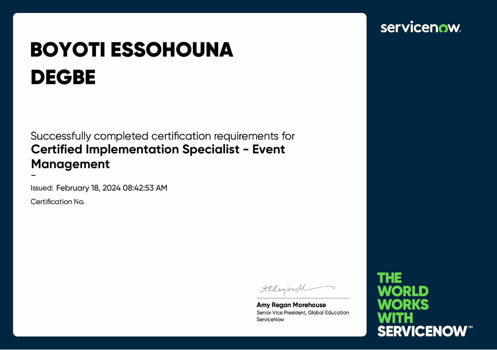
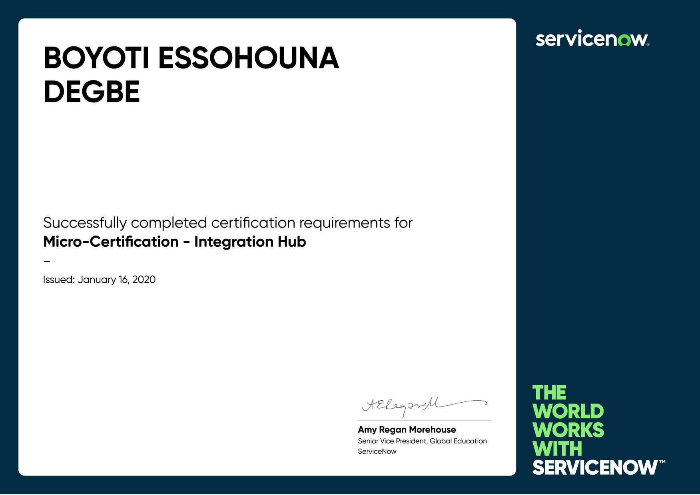

Hello, I'm Boyoti, ServiceNow developer with over five years experience, I contribute to the success of enterprise digital transformation through my expertise on the ServiceNow platform and my good understanding of business processes.

Focused on value creation, I'm intellectually curious about various technologies and methodologies involved in automating and business process optimization.

Having worked in the past as network and system administrator, I have acquired experience that allows me to work on ServiceNow's ITSM and ITOM (Visibility and Health) modules.

This site is designed to introduce myself and share with you my experience on ServiceNow and other areas that interest me. There are no ads or sponsored articles.

## Contact

I'm just around you, if you have any comments, ideas, criticisms, or if you just want to say hello, feel free to send me an e-mail at [boyotidegbe.com](mailto:hello@boyotidegbe.com) !

- **Skype**: [Boyoti](https://join.skype.com/invite/kH0u8NX4RoyD?call)
- **GitLab**: [Boyoti](https:/gitlab.com/Boyoti)
- **GitHub**: [Boyoti](https://github.com/Boyoti)
- **LinkedIn**: [Boyoti E. DEGBE](https://www.linkedin.com/in/boyoti-essohouna-degbe/)
- **View my resume**: [Boyoti E. DEGBE](/resume)
- **Direct mailbox**: [boyoti.degbe@gmail.com](mailto:boyoti.degbe@gmail.com)

## Tools

My favorite working tools. 😉

- This site is hosted on [Netlify](https://www.netlify.com/) from [Github](https://github.com/) and uses the [Gatsby](https://www.gatsbyjs.com/) framework.
- I personally prefer to work on a Linux or Mac computer.
- I develop on [ServiceNow](https://www.servicenow.com/) mainly with [JavaScript](https://www.javascript.com/).
- My favorite code editor is [Visual Studio](https://visualstudio.microsoft.com/).
- We'll talk about the rest over coffee.

## Publications

Where to find some of my articles for developers.

- <a href="https://itscalecenter.com/" target="_blank">IT Scale Center</a>

## Certificates

My certifications and awards.

  <!-- 

    <button type="button" data-bs-target="#carouselExampleInterval" data-bs-slide-to="0" class="active" aria-current="true" aria-label="Slide 1"></button>
    <button type="button" data-bs-target="#carouselExampleInterval" data-bs-slide-to="1" aria-label="Slide 2"></button>
    <button type="button" data-bs-target="#carouselExampleInterval" data-bs-slide-to="2" aria-label="Slide 3"></button>
  
 -->
  

    <!-- To define the display duration : (class="carousel-item active" data-bs-interval="6000")
    Valid certification size : Width (2479) Height (1744) (https://photoutils.com/) -->
    

      
      <!-- 

        <h5 class="itscCarousel">ServiceNow ITOM</h5>
        
Discovery Implementation Specialist Certification

      
 -->
    

    

      
      <!-- 

        <h5 class="itscCarousel">ServiceNow ITOM</h5>
        
Event Management Implementation Specialist Certification

      
 -->
    

    

      
      <!-- 

        <h5 class="itscCarousel">ServiceNow Platform</h5>
        
Application Developer Certification

      
 -->
    

    

      
      <!-- 

        <h5 class="itscCarousel">ServiceNow Platform</h5>
        
System Administrator Certification

      
 -->
    

    

      
      <!-- 

        <h5 class="itscCarousel">IT Service Management</h5>
        
ITIL® 4 Foundation Certification

      
 -->
    

    

      
      <!-- 

        <h5 class="itscCarousel">Agile Project Management</h5>
        
PRINCE2® Agile Foundation Certification

      
 -->
    

    

      
      <!-- 

        <h5 class="itscCarousel">Microsoft Azure</h5>
        
AZ 900 Azure Fundamentals Certification

      
 -->
    

    

      
      <!-- 

        <h5 class="itscCarousel">ServiceNow ITOM</h5>
        
CMDB Health Micro-Certification

      
 -->
    

    

      
      <!-- 

        <h5 class="itscCarousel">ServiceNow ITOM</h5>
        
CMDB Configuration Micro-Certification

      
 -->
    

    

      
      <!-- 

        <h5 class="itscCarousel">ServiceNow Platform</h5>
        
Integration Hub Micro-Certification

      
 -->
    

    

      
      <!-- 

        <h5 class="itscCarousel">ServiceNow Platform</h5>
        
Flow Designer Micro-Certification

      
 -->
    

    

      
      <!-- 

        <h5 class="itscCarousel">ServiceNow ATF</h5>
        
Automated Test Framework Micro-Certification

      
 -->
    

    

      
      <!-- 

        <h5 class="itscCarousel">ServiceNow SPM</h5>
        
Agile and Test Management Implementation Micro-Certification

      
 -->
    

    

      
      <!-- 

        <h5 class="itscCarousel">ServiceNow Platform</h5>
        
Performance Analytics Micro-Certification

      
 -->
    

    

      
      <!-- 

        <h5 class="itscCarousel">ServiceNow Platform</h5>
        
Service Portal Micro-Certification

      
 -->
    

    

      
      <!-- 

        <h5 class="itscCarousel">ServiceNow Platform</h5>
        
Subscription Model Micro-Certification

      
 -->
    

  

  <button class="carousel-control-prev" type="button" data-bs-target="#carouselExampleInterval" data-bs-slide="prev">
    
    Previous
  </button>
  <button class="carousel-control-next" type="button" data-bs-target="#carouselExampleInterval" data-bs-slide="next">
    
    Next
  </button>

