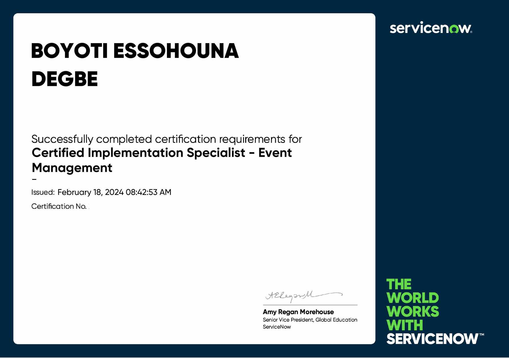
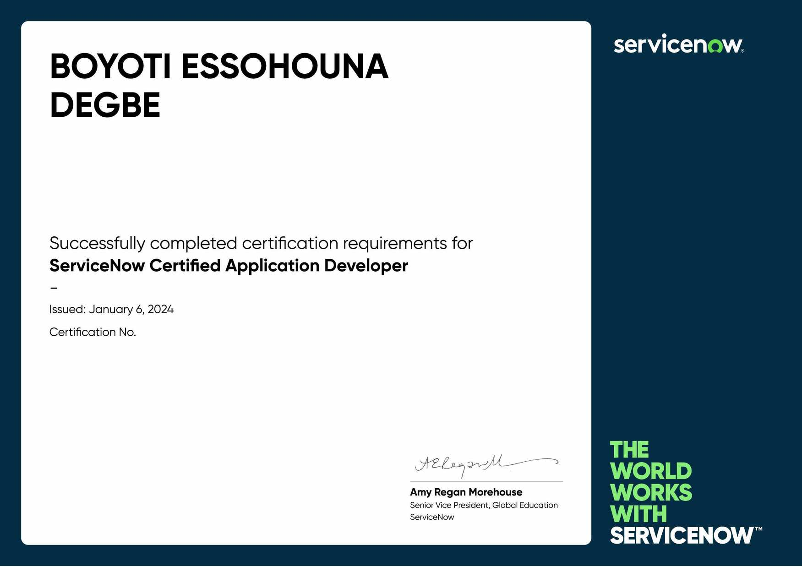
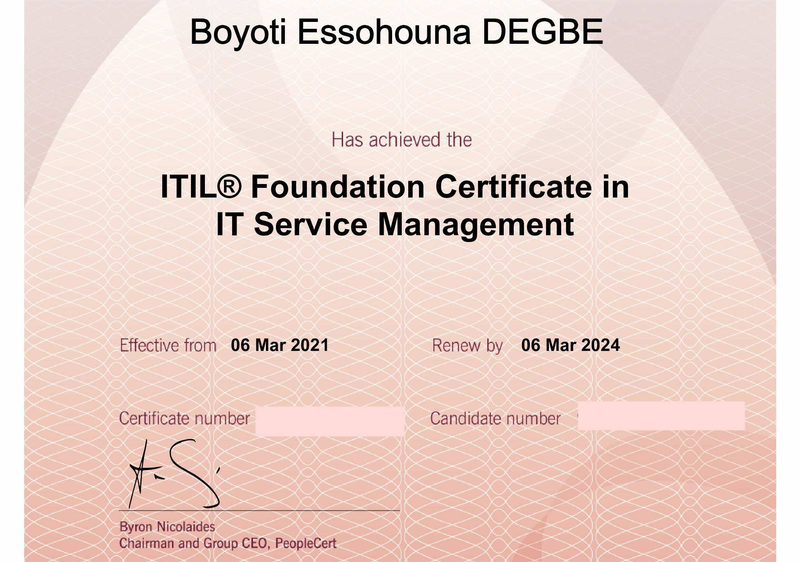
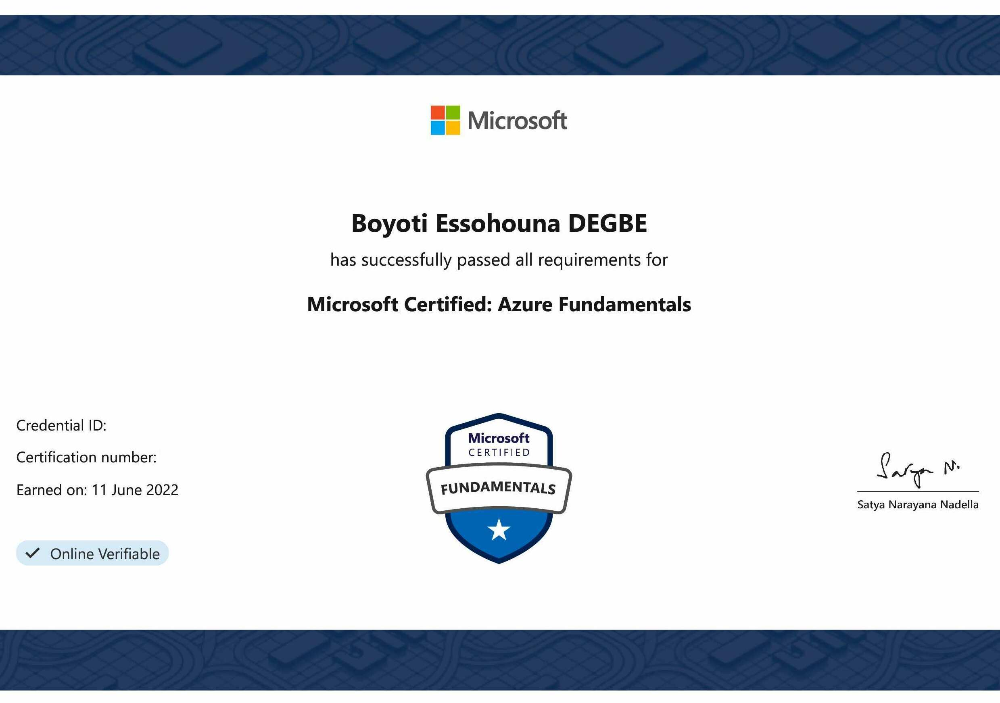

<a href="/resume/BoyotiEssohounaDEGBE_20240430.pdf" download="Boyoti_Essohouna_DEGBE_Resume.pdf">Download as PDF</a>

### Senior ServiceNow Developer

- [Email me](mailto:boyoti.degbe@gmail.com)
- Address : Montreal, Quebec, Canada

## Technical Skills

### ServiceNow Developer skills

<table>
  <tr>
    <td>UI Pages</td>
    <td>Flow Designer</td>
  </tr>
  <tr>
    <td>Notifications</td>
    <td>Scheduled Jobs</td>
  </tr>
  <tr>
    <td>Integration HUB</td>
    <td>Domain Separation</td>
  </tr>
  <tr>
    <td>Scripted REST API's</td>
    <td>Client-side Scripting</td>
  </tr>
  <tr>
    <td>Server-side Scripting</td>
    <td>Performance Management</td>
  </tr>
  <tr>
    <td>Automated Test Framework</td>
    <td>Inbound REST/SOAP integrations</td>
  </tr>
  <tr>
    <td>Outbound REST/SOAP Integrations</td>
    <td>Agent workspace / ITSM Workspace</td>
  </tr>
</table>

### ServiceNow Products

- <a href="https://www.servicenow.com/products/itsm.html" target="_blank">ITSM</a> - All modules
- <a href="https://www.servicenow.com/products/customer-service-management.html" target="_blank">CSM</a> - Customer Service Management
- <a href="https://www.servicenow.com/products/it-asset-management.html" target="_blank">ITAM</a> - Integration and mid-level development
- <a href="https://www.servicenow.com/products/it-operations-management.html" target="_blank">ITOM</a> - Event Management, Discovery and Service Mapping
- <a href="https://www.servicenow.com/products/business-management.html" target="_blank">ITBM</a> - Demand Management, Project Portfolio Management, Agile Development and Test Management

### Other Technical Skills

- **Cloud platform:** Amazon Web Services (AWS), Azure
- **Other concepts:** Algorithm, Agile, Multi-threading, MVC
- **Programming languages:** Java, JavaScript, Angular JS, jQuery
- **Web technologies:** XML, JavaScript, HTML, CSS, PHP, Ajax, JSON
- **Databases:** MySQL, Oracle, Microsoft SQL Server, SQLite, PostgreSQL

## Professional Experience

### Senior ServiceNow Developer
**DESJARDINS** - September, 2022 - Present | Montreal, Quebec

- ServiceNow expertise areas: ITSM (incident management, problem management, change management, service request management, agile methodology, agent workspace, dashboards, - knowledge base, reports, etc.), ITOM (event management, discovery, service mapping), PPM (agile management, test management, etc.).
- Monitor changes in ServiceNow platform technology.
- Provide technical advice and support to project stakeholders.
- Implement and/or enhance ServiceNow platform functionalities.
- Deploy update packages and batch update packages after each sprint.
- Review and analyze business requirements with product managers and prepare stories.
- Run various demonstration sessions to showcase end-to-end ServiceNow functionality.
- Set up Instance Scans to enforce compliance with ServiceNow development best practices.
- Help develop new feature plans and manage ServiceNow upgrades and release of new features.
- Participate in Agile ceremonies, story discussions and sprint planning with the project team.
- Set up the "Integrations Launchpad" application to facilitate ITOM Health connector management.
- Creation reference documents for features in progress and features completed during the sprint.
- On-call team member to handle incidents related to all applications implemented on our instances.
- Implement procedures for platform maintenance, security, troubleshooting and performance monitoring.
- Configuration of OBM, SCOM, Solarwinds connectors, etc. for Event Management application event collection.
- Monitor and maintain stability of ServiceNow platforms by auditing logs, Scheduled Jobs and execution queues.
- Work in collaboration with Tech Leads and Architects to propose maintainable, optimal and secure solutions on our platforms.
- Ensure that ITOM Health module developments are carried with a high level of quality so as not to affect instance performance.
- Collaborate with the offshore team and assign tasks to them when resource allocation has reached its maximum within the local team.
- Analysis, resolution and documentation of incidents, problems, malfunctions and critical and priority tasks identified on ServiceNow platforms.
- Set up Splunk integration to collect logs from ServiceNow platforms as part of the supervision of ServiceNow instances via the Event Management application.
- Monitor platform performance and stability using ServiceNow's free tools (Application Insights, System Diagnostics Modules, etc.), and ServiceNow Impact's paid tools (Instance Observer, etc.).
- Administration of MID servers deployed on our platforms for event collection (ITOM Health), configuration item discovery and service mapping (Discovery), and for integrations with our third-party tools (SCM, AD, ...).
- Act as Tech Lead within the ITOM Health implementation team, advising on good implementation practices, making suggestions on integration methods, making recommendations on which ServiceNow applications to implement to meet business objectives, and setting up processes to enable us to achieve the level of service expected by our management.

### Senior ServiceNow Developer
**YAWIZE** - July, 2019 - August, 2022 | Dakar, Senegal

- ServiceNow expertise areas: ITSM (incident management, problem management, change management, service request management, agile methodology, agent workspace, dashboards, - knowledge base, reports, etc.), ITOM (discovery, CMDB), PPM (agile management, test management, etc.), CSM (Customer Service Management).
- Manage the development cycle of ServiceNow projects.
- Lead, train and mentor a team of ServiceNow developers.
- Discussed stories and planned sprints with the project team.
- Implement and/or enhance customer ServiceNow functionalities.
- Analyze and translate customer needs into technical solutions.
- Monitor technological developments on the ServiceNow platform.
- Implemented and improved upgrade process for customer platforms.
- Participate in Agile ceremonies with each customer's project team.
- Train our customers' ServiceNow platform administrators and users.
- Design and develop ServiceNow applications and workflows for our customers.
- Reviewed and analyzed business requirements with product managers and write stories.
- Lead various demonstration sessions to showcase end-to-end ServiceNow functionality.
- Conduct unit tests for all use cases and functional requirements proposed for projects.
- Ensure that ServiceNow projects are delivered on time and with a high level of quality.
- Collaborate with cross-functional teams to deliver end-to-end solutions to our customers.
- Leveraged "Connection and Credential Aliases" module to configure legacy system api specs.
- Configure business rules and scripts to work with REST messages after submission of a service catalog.
- Participate in the recruitment of new consultants and organize their training on the ServiceNow platform.
- Configuration and customization of service catalog elements and use of the flow designer to trigger requests.
- Technical discussions with ServiceNow representatives and developers to find or develop solutions for customer use cases.
- Integration with various ServiceNow platforms and third-party applications using REST, SOAP and custom API configuration.
- Leveraged Retry policy module to specifically determine how many times an API call has to be made before resulting in complete failure.
- Error handling using a script block to differentiate and execute numerous activities based on response code received from legacy systems.
- Analysis, resolution and documentation of incidents, problems, malfunctions and critical and priority tasks identified on our customers' ServiceNow platforms.
- Team lead ServiceNow developers and teach them best practices, innovations and ServiceNow capabilities to help them achieve their mission objectives with our customers.
- Configure catalog client scripts and improve the functionality of existing UI policies, UI actions, business rules and client scripts (basically, server-side and client-side scripts).

### ServiceNow Developer
**HUB4IT** - January, 2018 - July, 2019 | Dakar, Senegal

- ServiceNow expertise areas: ITSM (Incident Management, Problem Management, Change Management, Service Request Management, Agile Methodology, Agent Workspace, Dashboards, Knowledge Base, Reporting, etc.), ITOM (Discovery, CMDB), CSM (Customer Service Management).
- Monitoring ServiceNow platform technology developments.
- Discuss stories and plan sprints with the project team.
- Train customer ServiceNow platform users and administrators.
- Implement and/or enhance customer ServiceNow functionalities.
- Implement and improve the upgrade process for our customers' platforms.
- Analysis, design and implementation processes on the ServiceNow platform.
- Design and develop ServiceNow applications and workflows for our customers.
- Jelly scripting for all notifications, content management and business rules.
- Unit testing for all use cases and functional requirements proposed for projects.
- Run various demonstration sessions to showcase end-to-end ServiceNow functionality.
- Head of the innovation team for research and development of new solutions on ServiceNow.
- Sending and receiving data between several systems when a UI action is clicked on a form.
- Participate in the recruitment of new consultants and organize their training on the ServiceNow platform.
- Integration with various ServiceNow platforms and third-party applications using REST, SOAP and custom API configuration.
- Collaborate with multiple teams to facilitate the implementation process between the end-user, analysts and development team.
- Configure catalog client scripts and improve functionality of existing UI policies, UI actions, business rules and client scripts (basically, server-side and client-side scripts).

### Senior IT Technician
**SONATEL GROUP** - December, 2016 - November 2017 | Dakar, Senegal

- ClickOnSite (COS) security management.
- Interconnection between COS/KYN and COS/IMS.
- Administration and level 1 support for the COS tool.
- Administration and level 1 support for the KYN tool.
- Creation of comparison and data migration scripts in VBA, SQL and JS.
- Wrote technical, functional and test specifications for ClickOnSite developers.
- Collected and ensured the reliability of GSM site data and loaded it into the COS tool.
- Provide recommendations for improvements to ClickOnSite. Assistant project manager for ClickOnSite deployment.

### Java EE Developer
**INEKTO GROUP** - February, 2015 - July, 2015 | Dakar, Senegal

- Java EE software developer.
- Writing technical recipe manuals.
- Conduct functional and technical workshops.
- Wrote technical and functional specifications.
- Configured and deployed Glassfish server on OVH VPS.
- Learn ISO 8583 standard for application development.
- Designed money transfer software and developed reporting module.

### Systems and network technician
**Technologies Réseaux & Solutions (TRS)** - March, 2014 - September, 2014 | Lome, Togo

- Administration ( network services configuration) of customer LINUX servers.
- Administration of customer network equipment (routers, firewalls, switches, etc.).

### Systems and networks internship
**Technologies Réseaux & Solutions (TRS)** - July, 2013 - September, 2013 | Lome, Togo

- Learn and implement TCP/IP protocols.
- Learn how to configure CISCO equipment.
- Learn how to administer network services on a LINUX server.
- Use the Backtrack 5 tool (Kali Linux) to detect security vulnerabilities in a computer system or network.

## Education

### Master's degree (2014 to 2016) | Dakar, Senegal

**Area :** Teleinformatics, option Software Engineering and Network Administration

**School :** <a href="https://www.estm.sn/" target="_blank">ESTM</a> - École Supérieure De Technologie Et De Management De Dakar

### Bachelor's degree (2009 to 2013) | Lome, Togo

**Area :** Technology, Computer Networks and Telecommunications option

**School :** <a href="https://ucao-uut.tg" target="_blank">UCAO-UUT</a> - Université Catholique de l'Afrique de l'Ouest-Unité Universitaire du Togo

## Certifications

### ServiceNow certifications

<table>
  <tr>
    <td>CIS Discovery</td>
    <td>CMDB Micro-Certification</td>
  </tr>
  <tr>
    <td>Certified Application Developer</td>
    <td>Flow Designer Micro-Certification</td>
  </tr>
  <tr>
    <td>Integration Hub Micro-Certification</td>
    <td>Automated Test Framework Micro-Certification</td>
  </tr>
  <tr>
    <td>CIS Event Management</td>
    <td>Certified System Administrator</td>
  </tr>
  <tr>
    <td>CMDB Health Micro-Certification</td>
    <td>Service Portal Micro-Certification</td>
  </tr>
  <tr>
    <td>Performance Analytics Micro-Certification</td>
    <td>Agile and Test Management Micro-Certification</td>
  </tr>
</table>

### Others certifications

<table>
  <tr>
    <td>PRINCE2 Agile Certification</td>
    <td>AZ-900 Microsoft Azure Fundamentals</td>
  </tr>
  <tr>
    <td>ITIL® 4 Foundation Certification</td>
    <td></td>
  </tr>
</table>

## Languages

**French** - Fluent

**English** - Professional

## Areas of interest

<table>
  <tr>
    <td>Music</td>
    <td>Travel</td>
  </tr>
  <tr>
    <td>Cycling</td>
    <td>Team sports</td>
  </tr>
  <tr>
    <td>Photography</td>
    <td>Bodybuilding</td>
  </tr>
  <tr>
    <td>Toastmasters</td>
    <td>Research into new technologi</td>
  </tr>
</table>

  <!-- 

    <button type="button" data-bs-target="#carouselExampleInterval" data-bs-slide-to="0" class="active" aria-current="true" aria-label="Slide 1"></button>
    <button type="button" data-bs-target="#carouselExampleInterval" data-bs-slide-to="1" aria-label="Slide 2"></button>
    <button type="button" data-bs-target="#carouselExampleInterval" data-bs-slide-to="2" aria-label="Slide 3"></button>
  
 -->
  

    <!-- To define the display duration : (class="carousel-item active" data-bs-interval="6000")
    Valid certification size : Width (2479) Height (1744) (https://photoutils.com/) -->
    

      
      <!-- 

        <h5 class="itscCarousel">ServiceNow ITOM</h5>
        
Discovery Implementation Specialist Certification

      
 -->
    

    

      
      <!-- 

        <h5 class="itscCarousel">ServiceNow ITOM</h5>
        
Event Management Implementation Specialist Certification

      
 -->
    

    

      
      <!-- 

        <h5 class="itscCarousel">ServiceNow Platform</h5>
        
Application Developer Certification

      
 -->
    

    

      
      <!-- 

        <h5 class="itscCarousel">ServiceNow Platform</h5>
        
System Administrator Certification

      
 -->
    

    

      
      <!-- 

        <h5 class="itscCarousel">IT Service Management</h5>
        
ITIL® 4 Foundation Certification

      
 -->
    

    

      
      <!-- 

        <h5 class="itscCarousel">Agile Project Management</h5>
        
PRINCE2® Agile Foundation Certification

      
 -->
    

    

      
      <!-- 

        <h5 class="itscCarousel">Microsoft Azure</h5>
        
AZ 900 Azure Fundamentals Certification

      
 -->
    

    

      
      <!-- 

        <h5 class="itscCarousel">ServiceNow ITOM</h5>
        
CMDB Health Micro-Certification

      
 -->
    

    

      
      <!-- 

        <h5 class="itscCarousel">ServiceNow ITOM</h5>
        
CMDB Configuration Micro-Certification

      
 -->
    

    

      
      <!-- 

        <h5 class="itscCarousel">ServiceNow Platform</h5>
        
Integration Hub Micro-Certification

      
 -->
    

    

      
      <!-- 

        <h5 class="itscCarousel">ServiceNow Platform</h5>
        
Flow Designer Micro-Certification

      
 -->
    

    

      
      <!-- 

        <h5 class="itscCarousel">ServiceNow ATF</h5>
        
Automated Test Framework Micro-Certification

      
 -->
    

    

      
      <!-- 

        <h5 class="itscCarousel">ServiceNow SPM</h5>
        
Agile and Test Management Implementation Micro-Certification

      
 -->
    

    

      
      <!-- 

        <h5 class="itscCarousel">ServiceNow Platform</h5>
        
Performance Analytics Micro-Certification

      
 -->
    

    

      
      <!-- 

        <h5 class="itscCarousel">ServiceNow Platform</h5>
        
Service Portal Micro-Certification

      
 -->
    

    

      
      <!-- 

        <h5 class="itscCarousel">ServiceNow Platform</h5>
        
Subscription Model Micro-Certification

      
 -->
    

  

  <button class="carousel-control-prev" type="button" data-bs-target="#carouselExampleInterval" data-bs-slide="prev">
    
    Previous
  </button>
  <button class="carousel-control-next" type="button" data-bs-target="#carouselExampleInterval" data-bs-slide="next">
    
    Next
  </button>

