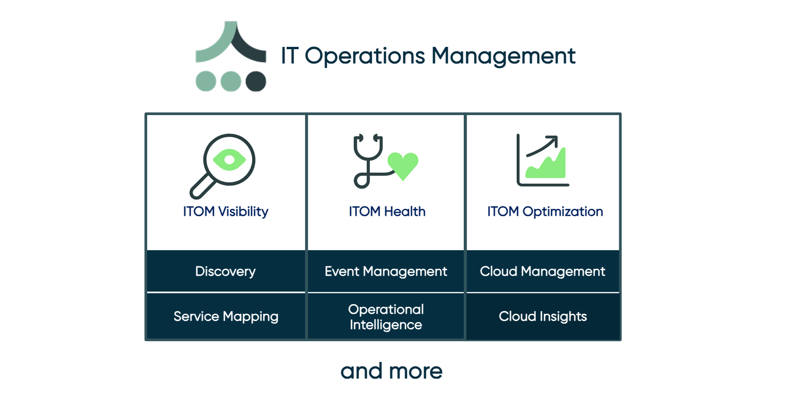
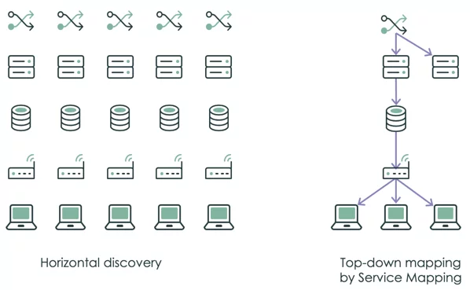
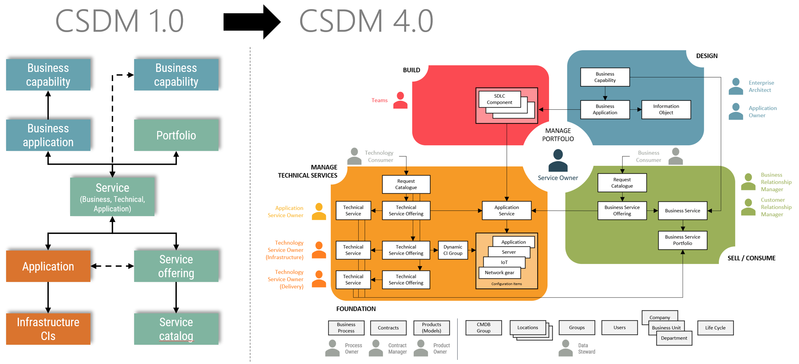
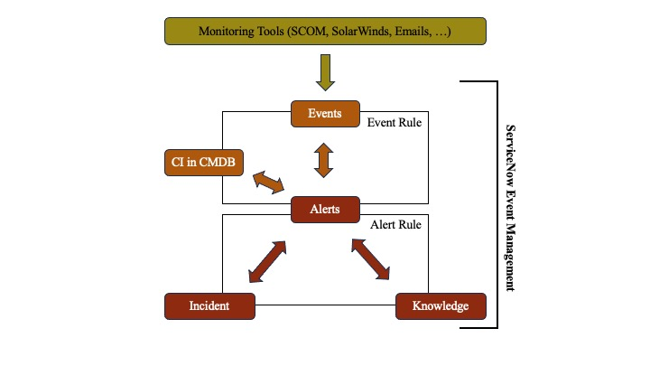

In this article, we’ll introduce the ServiceNow Event Management application, highlighting its objectives and the concepts needed to successfully implement it.

## Table of Contents

1. [General Overview](#general-overview)
2. [Useful information](#useful-information)
3. [The benefits of Event Management](#the-benefits-of-event-management)
4. [Glossary](#glossary)

# General Overview

Like a car’s dashboard, which helps avoid surprises (dry breakdowns, deflation, etc.) on the road, Event Management is an application that gives us visibility over the health of our IT infrastructure. Based on the events (anomalies) collected from monitoring tools, Event Management enables us to implement preventive and/or corrective operations in the worst-case scenario, in order to limit the impact of these events on the services provided by the organization.

In this series of articles, we will illustrate the benefits of this application and the steps involved in implementing it within an organization.

**NB:** Please feel free to comment on these articles to enrich them, or write to us with any suggestions or requirements you may have for this or any other ServiceNow product.

# Useful information

The Event Management application uses elements of the CMDB (Configuration Management Database) to accomplish its mission. To fully understand how this application works, we invite you to familiarize yourself with the following concepts:

[IT Operation Management (ITOM):](https://docs.servicenow.com/bundle/washingtondc-it-operations-management/page/product/it-operations-management/reference/r_ITOMApplications.html) This is the suite of ServiceNow products used to manage IT operations. The suite currently comprises four main applications:

- **ITOM Visibility:** Discovery + Service Mapping
- **ITOM Health:** Event Management + Operational Intelligence
- **ITOM Optimization:** Cloud Management + Cloud Insights

[Discovery (Horizontal discovery):](https://docs.servicenow.com/bundle/washingtondc-it-operations-management/page/product/discovery/concept/c_GetStartedWithDiscovery.html) Horizontal discovery is a technique used by Discovery to scan your network, find computers and devices, and then populate the CMDB with the CIs it finds. Horizontal discovery creates direct relationships between CIs, such as a “run on” relationship between an application CI and the computer CI on which it is running. Horizontal search is not aware of Business Services, and does not create relationships between CIs based on the Business Service in which they are located.

[Service Mapping (Top-down discovery):](https://docs.servicenow.com/bundle/washingtondc-it-operations-management/page/product/service-mapping/reference/c_ServiceMappingOverview.html) Top-down discovery is a technique used by Service Mapping to find and map critical infrastructures that are part of Business Services, such as an e-mail service. For example, top-down discovery can be used to map an enterprise web site service by showing the relationships between an Apache Tomcat web server service, a Windows server and the MSSQL database that stores the Business Service data.

**NB:** It’s important to note that if the CMDB data is not correctly organized, the Event Management application won’t bring us any benefits. That’s why we invite you to follow the CSDM standard for properly structuring your CMDB.

# The benefits of Event Management

Before going deeper, it is important to note that the Event Management application does not replace the monitoring tools in place within the organization, and is therefore not a monitoring tool. Its mission is to :

1. Consolidate events from different sources
2. Filter events to reduce noise and generate qualified events
3. Link events to CIs (Configuration Items) in the CMDB (Configuration Management Database)
4. Identifies alerts created due to planned maintenance (change)
5. Performs service impact analysis
6. Provides a Service Operator Workspace and Dashboard to understand service health and view service statistics
7. Create ServiceNow tasks for alerts
8. Help remediate alerts, automatically or manually
9. Bridge the gap between infrastructure and application

As mentioned above, these benefits derive not only from the application of Event Management, but also from the implementation of a good CMDB with the CSDM standard.

*In our next article, we'll be talking about event management architecture. In the meantime, we wish you an excellent day and a wonderful week!*

# Glossary

> **Service Operations Workspace:** This is a dashboard that provides a view of the impact of alerts on applications and services.

> **Event Dashboard:** Provides a quick view of active alerts and affected services.

> **Event:** A notable occurrence or notification from the infrastructure.

> **Metric:** This is a measure of a device’s operating characteristic over time.

**[Back to top](#table-of-contents)**