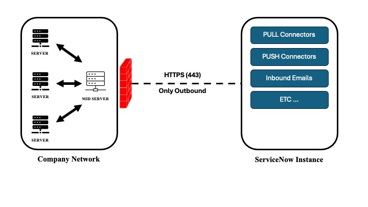

In this article, we will describe the ServiceNow Event Management implementation architecture, as well as the elements involved in this implementation.

## Table of Contents

1. [MID Server](#mid-server)
2. [Discovery and Service Mapping](#discovery-and-service-mapping)
    1. [Discovery](#discovery)
    2. [Service Mapping](#service-mapping)
3. [Dependency View Map vs Application Service Map](#dependency-view-map-vs-application-service-map)
    1. [Dependency View Map](#dependency-view-map)
    2. [Application Service Map](#application-service-map)
4. [Common Services Data Model](#common-services-data-model)
5. [Application Service Creation](#application-service-creation)
    1. [Manual creation](#manual-creation)
    2. [Automated creation](#automated-creation)
6. [Glossary](#glossary)

# MID Server

As we mentioned in the previous article, the ServiceNow Event Management process is based on information collected from monitoring platforms within the organization. This information is collected through various methods (Push Connectors, Pull Connectors, Emails …), some of them pass through what we call the MID Server.

MID for Management, Instrumentation and Discovery is a Java application that can be installed on a Windows or Linux server. This application establishes secure communication between your ServiceNow instance and the organization’s local network. Communication is outbound between the MID and your instance, and uses the SOAP method on port 443 (HTTPS).

The MID Server is also involved in several other ServiceNow platform processes, as shown in the image below.

To install the MID Server, we recommend that you follow the ITOM Guide:

> - All > Guided Setup – Legacy > ITOM Guided Setup > Get Started > MID Server
> - Follow the three MID installation steps
1. Create a MID server account on the instance and give it the mid_server role.
2. Download and install the appropriate MID application file on the host server.
3. Run the application and validate the MID to ensure it is reliable.

**NB:** The MID Server must be installed in the DMZ or directly behind a firewall and must be able to communicate with the servers to be discovered, as well as with the supervision tools from which events are collected.

Communication between the MID server and the instance takes place via the ECC Queue table. The ServiceNow instance inserts records (jobs) destined for the MID server into the ECC Queue table (outpout record), and the MID continuously polls this table to identify unprocessed records, an operation known as Polling. By default, polling is performed every 40 seconds. The frequency can be modified by the mid.poll.time parameter.

# Discovery and Service Mapping

## Discovery

Discovery is the process of identifying and collecting all the applications and devices installed on your network, and then updating the CMDB based on that collected information. ServiceNow discovery is agentless and allows you to discover many different types of elements, such as Operating Systems, Applications, Running Processes, Application Supporting CIs and many more.

Discovery is carried out through the MID servers, which execute a series of commands (Probes) received from the ServiceNow platform to the local network, and return the result of these commands to the instance in XML format (input records in the ECC Queue table). The XML result is then processed by the Sensors, which update the CMDB according to the existence or non-existence of the collected devices. The discovery process is divided into four phases:

## Service Mapping

Also known as Top-Down discovery, it covers only the service components and ignores everything else. It enables the Operations team to become aware of the services by providing targeted discovery of the IT infrastructure directly linked to the supported services.

# Dependency View Map vs. Application Service Map

Event Management includes both the Dependency View and the Application Services Map.

## Dependency View Map

1. Displays all dependency relationships between configuration items based on network traffic.
2. The selected CI or starting point is called Root CI with a pulsing effect.
3. Upstream and Downstream relationships are visible and, by default, up to three levels of upstream and downstream relationships are visible.

## Application Service Map

1. The application Services Map provides a topological view of a specific application service.
2. The application service entry point is the highest layer, followed by the downstream relationship of consecutive configuration items.
3. Event Management highlights the service map by linking alerts to these configuration items to represent the health of the service.

# Common Services Data Model

Event Management and ITOM Health improve the ability to realize the impact of problems on the company’s services, and to prioritize accordingly. The better the service organization, the more effective the impact calculation, triage and problem resolution.

**Service:** a Service is a way of delivering value to customers, facilitating the results they want to achieve, without them having to assume specific costs and risks.

**Baseline Services :**

1. **Business Services:** These are generally ordered by business users. The user can select the derived service offering and service commitment levels via the service catalog.
2. **Application Service:** This is the logical representation of deployed application stacks, such as a single instance of an application.
3. **Technical Services:** These are published for service owners, and generally underpin one or more enterprise or application services.

# Application Service Creation

## Automated creation

Service Mapping enables you to discover all the services in an organization and draw up a complete map of all the devices, applications and configuration profiles used in these services.

* **Agentless:** no additional software is required on target devices.
* **Service-centric:** it discovers only CIs related to the defined service.
* **Configuration-based:** does not rely on network traffic (netstat).

## Manual creation

Event Management allows you to manually create an application service using existing CIs and their relationships in the CMDB.

**Required role:** app_service_admin

*In our next article, we'll talk about the Event Management Process and how it works. In the meantime, we wish you an excellent day and a wonderful week!*

# Glossary

> **AMB :** Asynchronous Messaging Bus

> **ECC :** External Communication Channel

> **MID :** Management, Instrumantation and Discovery

**[Back to top](#table-of-contents)**