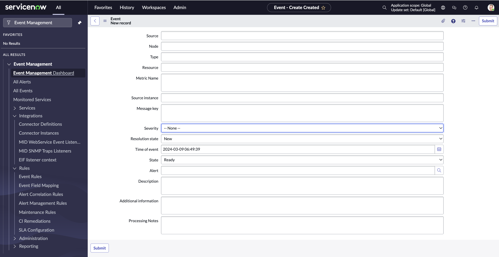
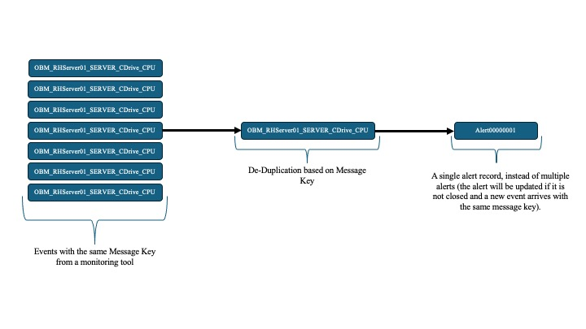
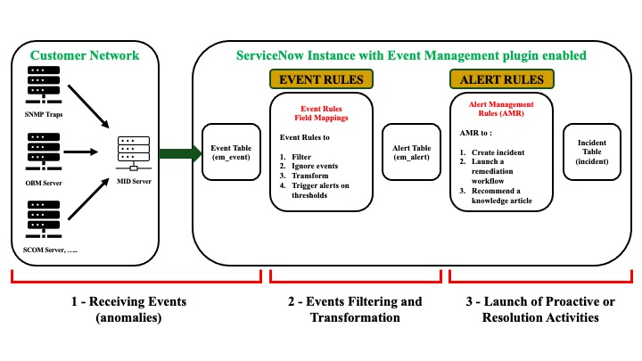
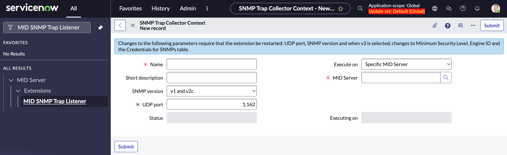
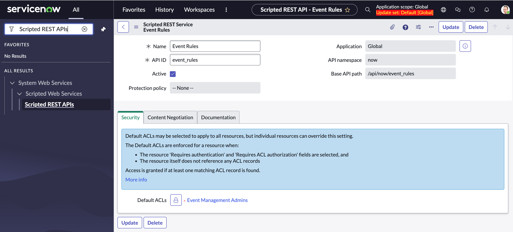
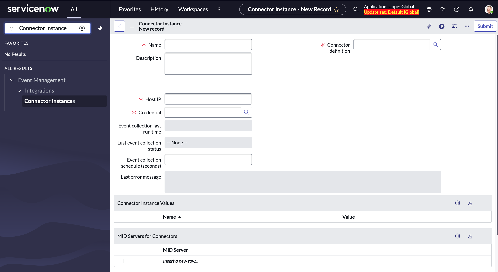

In this article, we’ll talk about the ServiceNow Event Management process itself, from the reception of the Events (anomalies) from the monitoring tools to their proactive or corrective resolution. For better organization, we’ll cover the subject in three articles, this one being the first, the two others focusing on the transformation of events into alerts and then into incidents or proactive tasks.

## Table of Contents

1. [Main tables and configuration](#main-tables-and-configuration)
2. [Event Records Overview](#event-records-overview)
3. [Message key](#message-key)
4. [Event Processing Overview](#event-processing-overview)
    1. [Event reception (anomalies)](#event-reception-(anomalies))
    2. [Event filtering and transformation](#event-filtering-and-transformation)
    3. [Launching proactive or resolution activities](#launching-proactive-or-resolution-activities)

# Main tables and configuration

The Event Management application is built around three main platform tables:

**Event table (em_event):** the event table receives events from monitoring tools in near-real time, with relevant information about the issue.

**Alerts table (em_alert):** the alerts table receives alerts generated by event processing. Alerts are action triggers that can be associated with equipment or processes.

**Service table (cmdb_ci_service):** the service table is the parent table of the “Business”, “Technical” and “Applications” services, as well as other derived services. This table makes it possible to precisely identify the service concerned by alerts, and thus map its health status in detail.

Example of services derived from application services

* **Manual service:** cmdb_ci_service_manual
* **Tag-based service:** cmdb_ci_service_by_tag
* **Dynamic CI group:** cmdb_ci_query_based_service
* **Discovered application:** cmdb_ci_service_discovered

**NB:** Events older than five days are removed from the event table using the table rotation function. It is recommended to not change the table rotation value, as this may have an impact on system performance.

# Event Records Overview

**Source:** refers to the monitoring tool that generated the event.

**Node:** This is the configuration item on which the event occurred. It can be a CI name, MAC address, IP address or Fully Qualified Domain Name (FQDN).

**Type:** indicates the type of metric, e.g. disk or memory.

**Resource:** this refers to the resource within a node, such as the C drive, process name, etc.

**Metric name:** this is the name or attribute of the metric in the monitoring system.

**Message key:** a unique identifier for a specific event on a configuration item. The message key is responsible for event deduplication.

**Severity:** this is the criticality of the event, based on the values defined in the monitoring system. Available values are Critical, Major, Minor, Warning, OK and Clear.

**Processing notes:** provide feedback on processing. It shows event rules and other steps performed during processing.

**Status:** This represents the life cycle of an Event. Its values are Ready, Processed, Ignored or Error.

* **Ready** – when the event has not yet been processed by the system.
* **Processed** – when the event has been successfully processed by the system.
* **Ignored** – when the event has been ignored by an event rule.
* **Error** – when the event has encountered an error during processing.

**NB:** if the event’s **“Severity”** is empty, the event cannot be processed and the status will be **“Error“**.

# Message key

The message key is unique and identifies the event. It determines whether an existing alert should be updated or not.

If the event has no key provided at the source, the key is automatically populated with: Source, Node, Type, Host resource and Metric name (**Source_Node_Type_Resource** on **host_Metric** name).

**NB:** repetitive events use the same key, the alert uses the same key as the event, and an alert can have more than one event attached.

# Event Processing Overview

Event processing is carried out in three steps:

1. **Event reception (anomalies)**

This step involves receiving events from monitoring tools. These events are collected from several sources via the MID Servers. The MID Server collects events at a frequency of 120 seconds by default. This frequency can be modified by changing the value of the event collection property (evt_mgmt.connector.minimum_schedule).

**Event sources**

There are many different sources that can be configured to create events on ServiceNow.

* Configure the SNMP Trap function to send events to ServiceNow. For this method, we need to enable the SNMP Trap Listener on the MID Server.

* Use the APIs to send events via custom scripts (Scripted REST APIs) or using the REST API of the ServiceNow event table, or the REST API in the import set.

* Use vendor-based monitoring software to send an e-mail notification that can be treated as an event by Emails Actions or by Flows.
* Use vendor-based ServiceNow connectors to collect events through the ServiceNow MID Server.

2. **Event filtering and transformation**

In this step, events received from monitoring tools are filtered and transformed by event rules to generate meaningful alerts. This operation reduces the noise generated by events, binds events to configuration items and generates alerts for events requiring action.

3. **Launching proactive or resolution activities**

At this step, we can configure the system to perform proactive or resolution tasks by creating incidents, launching remediation processes or recommending knowledge articles to problem-solving members.

**NB:** By default, the tasks generated at this step is incidents, and the severity of the alert will determine the priority of these incidents. If we don’t want to generate incidents all the time, we can create a custom table extended from the tasks table to store that information.

*For the moment, I suggest we leave it there. In future articles on Event Management, we'll cover more in-depth the filtering and transformation of events, followed by the launching of proactive or resolution activities. In the meantime, I wish you an excellent day and a wonderful week!*

# Glossary

**[Back to top](#table-of-contents)**