In this article, we’ll focus on processing events into Alerts. This operation, which is the second step in the ServiceNow Event Management process, is performed by what are known as Event Rules. In this article, we’ll talk about how Event Rules work, and all the other elements involved in this step. Don’t hesitate to leave a comment or get in touch with us to improve this article or to ask any questions you may have concerning ServiceNow. Thank you and enjoy !

## Table of Contents

1. [Introduction](#introduction)
2. [Event Processing Detail](#event-processing-detail)
3. [The benefits of Event Management](#the-benefits-of-event-management)
4. [Processing Notes](#processing-notes)
5. [Event Rules](#event-rules)
    1. [Event Rule Info](#event-rule-info)
    2. [Event Filter](#event-filter)
    3. [Transform and Compose Alert Output](#transform-and-compose-alert-output)
    4. [Threshold](#threshold)
    5. [Binding](#binding)
6. [CI Binding Process Flow](#ci-binding-process-flow)
7. [Event Field Mapping](#event-field-mapping)

# Introduction

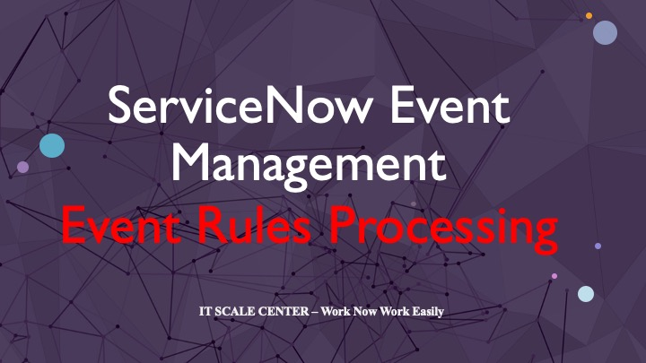

Event Rules are one of the main components in event processing, and there are usually predefined ones for various monitoring systems, which you can use as examples to help you configure your own. Event Rules have the following purposes:

1. Process raw event data
2. Convert events into alerts
3. Bind CIs more efficiently than default binding

**NB:** By default, events are automatically bind to the node that generated them; after processing, the Event Rule can more effectively bind to the node to which the event should indeed be binded. Let’s take the case of an Oracle database server installed on a Linux server. When an event is generated on the server, the default binding may link the event to the Linux server, but after processing the Event Rule, and depending on the criteria we’ve defined, the event may ultimately be bind to the Oracle database server, if that’s the one presenting the dysfunction. In this way, the alert and/or incident can be assigned to the right support group (Oracle team) rather than the wrong one (Linux team) due to the default binding.

Events come from various monitoring systems through MID servers and Connectors or REST APIs. An event record is inserted into the event table, where Event Rules and Event Field Mappings are applied to generate alerts. Alerts Management Rules are applied to the alerts generated by the Event Rules, in order to prioritize alerts for remediation and/or root cause analysis.

# Event Processing Detail

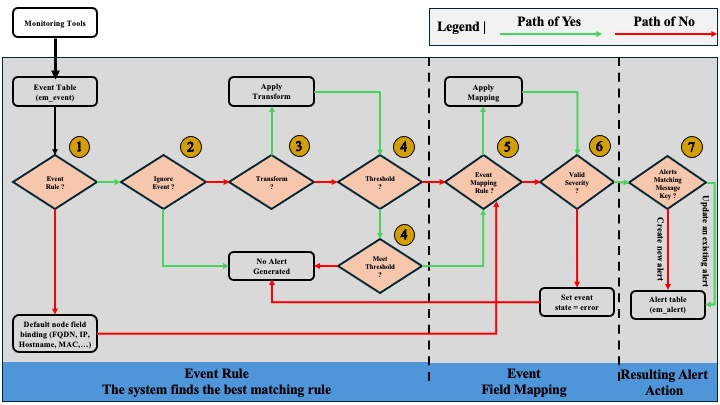

1. As events arrive in the event table, the system identifies the Event Rules to be applied to them. Event Rules are evaluated according to the order assigned in the configuration, to check if the source and optional filters match. If the event source and optional filters match those of the Rule, then the Event Rule will be executed.

**NB:** If no Rule matches, the default binding using the Node field to locate or match the CI hostname, FQDN, IP or MAC address is implemented and processing continues.

2. If the Ignore Event Rule checkbox is selected, no alert is generated. The event is left to be examined and remedied.

3. If Transformation and Composition Fields have been defined in the Event Rule, they will be applied.

4. If a Threshold is set, all events are accumulated until the threshold is reached, then processed.

**NB:** If the **“Apply Additional Matching Rule”** option is checked, the Threshold is deactivated and Event Rule processing continues.

5. Then apply the corresponding Event Field Mapping even if there is no corresponding Event Rule.

6. If no Severity is defined at this time, keep the event and set its status to Error, but do not generate an alert.

7. If the Severity is defined, search the alert table for the corresponding Message Key. If a match exists, update the alert and associate the event with the unique alert. If there is no match, create a new alert for root cause analysis purposes, and associate the event with the unique alert.

# Processing Notes

After processing an event, to view how the processing was applied, consult the Processing Notes field. It indicates the Event Rules and Field Mappings that have been applied to the event, the associated CI, the link to the executed Event Rule and also the rules that have not been applied.

As mentioned in the previous article, the life cycle of an event is defined by its state, which can be Ready, Processed, Ignored or Error.

# Event Rules

Event Rules are used to :

* Bind alerts to specific CIs in the CMDB, showing their impact on the correct Application Service in the Service Operator Workspace and in Event Dashboards.
* Transform and Compose alert information from relevant data in event fields.
* Ignore events that match the filter conditions and reduce incident noise until a defined threshold is reached.

**NB:** Since the Tokyo version, it is possible to apply multiple event rules by selecting Apply Additional Matching Rules to Event Rules. To simplify the creation of Event Rules, the Event Management application provides recommended rules based on tracked events. The recommended rules engine analyzes and groups events, and provides the Regex expressions used to create event groups.

The configuration of an Event Rule is performed in several steps on the Event Rules Form.

## Event Rule Info

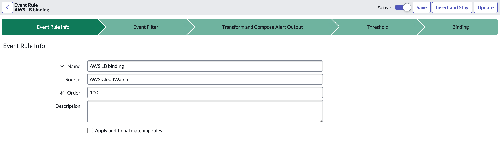

**Name:** Give an appropriate name to the Event Rule.

**Source:** Refers to the Source of the event. If this field is empty, all sources will be taken into account.

**Order:** Represents the execution order of the Rules. This is very important, as Rules are processed in the sequence specified, from the lowest to the highest.

**Description:** Used to add additional relevant information that can be used during processing or investigations.

## Event Filter

The Filter defines the conditions that must be met for the Rule to be applied. You can also ignore events based on the Filter criteria.

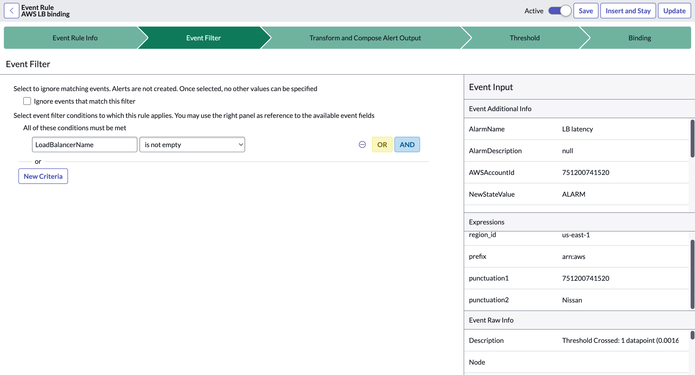

## Transform and Compose Alert Output

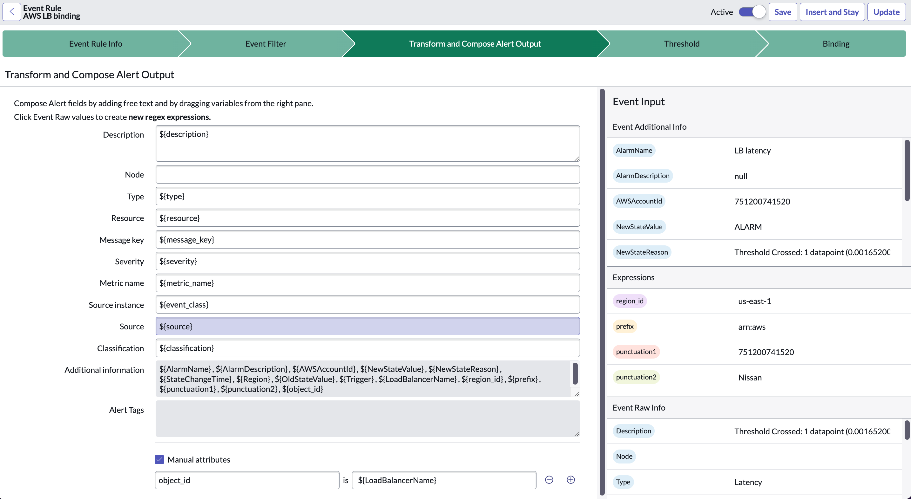

In this section, we define the transformation rules for obtaining the data required to generate alerts.

It’s important to note that all the data available to us are those received from the source. Based on that data and the Transformation Rules, we’ll deduce the useful values for alert generation. If we need more information than we’ve received, we may have to manage it directly on the source.

To compose the alert details, we need to drag the data from the data piles (on the left in the image) to the alert fields. Regexes can be used for complex compositions.

## Threshold

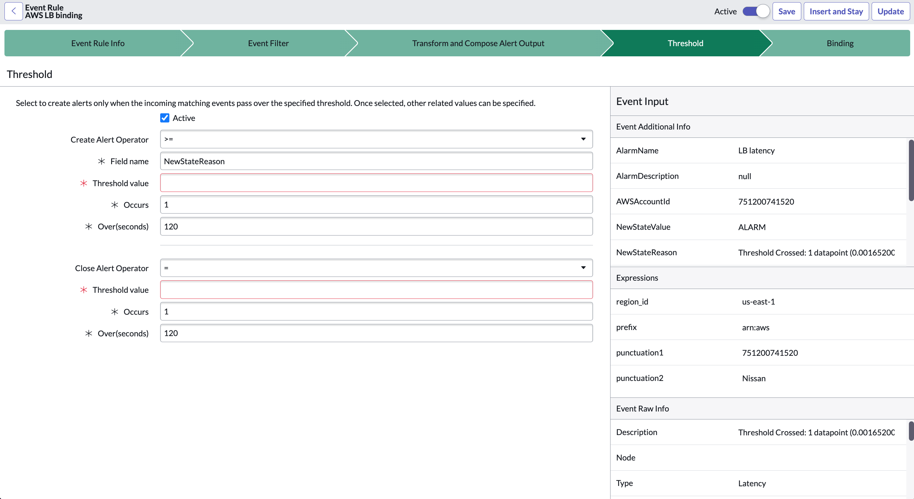

Thresholds allow events to be processed according to a threshold metric and volume over a given period; if the threshold is reached, an alert is generated.

By default, the active field is set to false; once set to true, the threshold can be defined as required.

**Create Alert Operator:** allows you to define the threshold operation you wish to implement. The form varies according to the selected operation.

**Field name:** defines the field to which the threshold will be applied.

**Threshold value:** defines the expected value of the field to trigger threshold calculation.

**Occurs:** defines the number of occurrences of the event before the alert is generated.

**Over(seconds):** define the frequency with which to check whether an event corresponding to the rule has occurred.

**Close Alert Operator:** allows you to define what is considered “quiet” and indicate that there is no longer a problem, then close the alert.

**NB:** The threshold is disabled for rules using “Apply Additional Matching Rules”.

## Binding

By default, events are bind to CIs based on the Node value, which is either a host name, IP address, MAC address or FQDN. To better bind alerts to the CIs concerned, the Event Rule uses this section to better identify the CI concerned in the CMDB. Two types of Binding are available:

[CI Identification:](https://support.servicenow.com/kb?id=kb_article_view&sysparm_article=KB1064718) attribute criteria (CMDB attributes specific to the CI class) matched to identify a CI class on the host. This is a unique identification process for a CI class. It uses the Identification, and Reconciliation Engine (IRE), based on Identification Rules, to find the appropriate CIs.

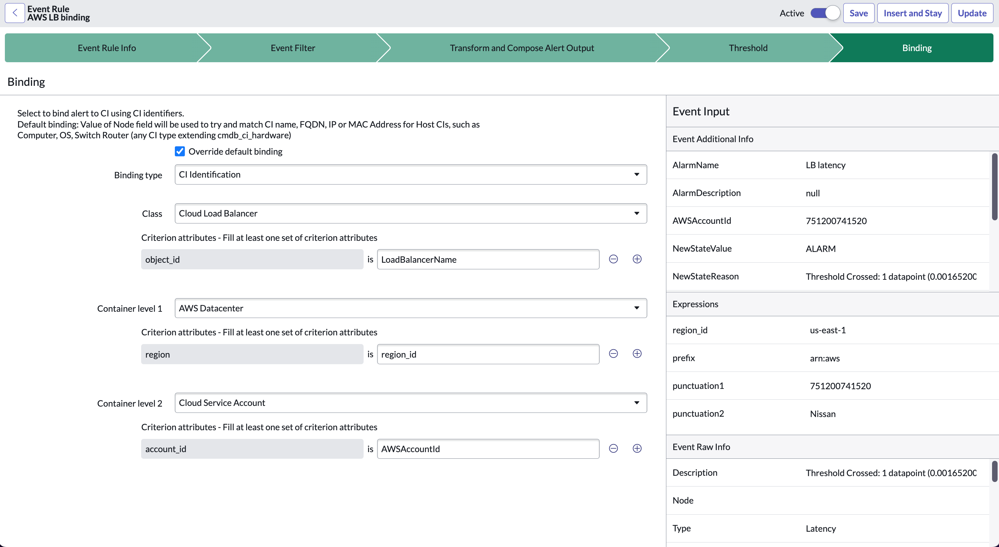

[CI Field Matching:](https://support.servicenow.com/kb?id=kb_article_view&sysparm_article=KB0831885) use of additional information (the pair fields : values) to identify the specific CI.

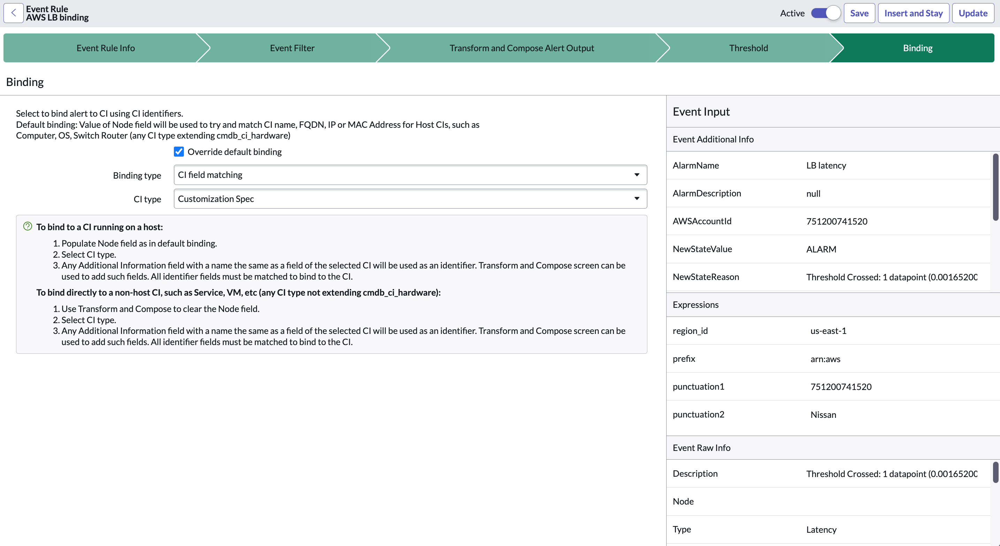

# CI Binding Process Flow

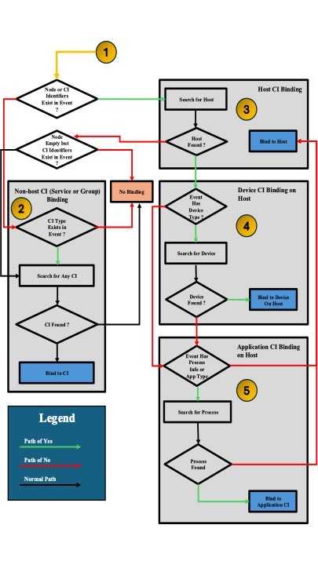

1. When an event arrives, Event Management checks the node or CI Identifiers.
2. If no Node exists, the generated alert can bind to the CI using the alert Type, Additional information, or Configuration item identifier fields.
3. If the event has a node value, search for a valid host.
4. If the event has a host and a CI type, try to bind to a device CI.
5. If the event has a host, try to bind to the application CI.

# Event Field Mapping

During Event Processing, after the Event Rules have been executed, the process continues with Event Field Mapping. This step aims to replace the information received from the event source with more meaningful and/or standardized information, before generating the alerts resulting from event processing.

By default, some Event Mapping Fields are provided for common monitoring systems. This allows us to start from an existing rule base that we can use to define our own rules. It is recommended to clone the default rules before modifying them.

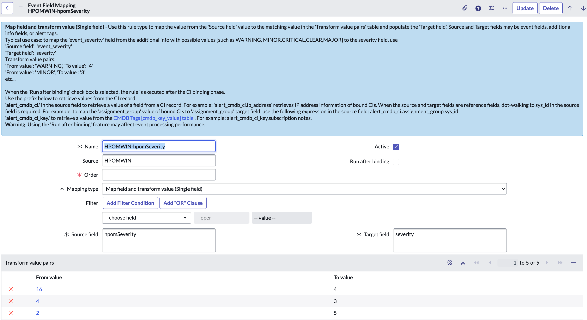

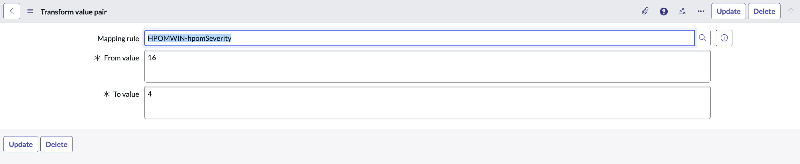

*In our next article, we'll look at the final step in the event management process. We'll be talking about triggering proactive or remediation activities. In the meantime, I wish you an excellent day and a wonderful week!*

# Glossary

> **CI:** Configuration Items

> **MAC:** Media Access Control

> **FQDN:** Fully Qualified Domain Name

> **REST:** REpresentational State Transfer

**[Back to top](#table-of-contents)**