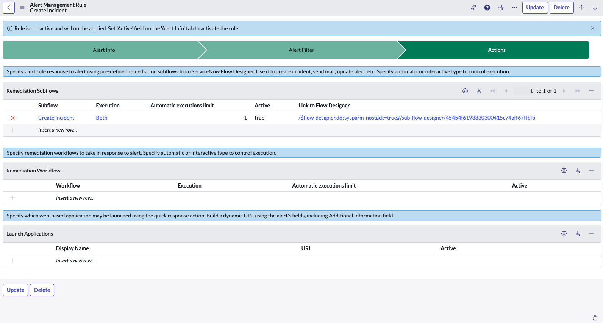

One of the key components of ServiceNow Event Management is the Alert Management Rules processing function. This powerful feature enables organizations to define rules and conditions that determine how alerts are handled and escalated in the system. In this article, we'll talk about the importance of these Rules, how they work, how to configure them and some best practices for their implementation. Don't hesitate to leave a comment or get in touch with us to improve this article or to ask any questions you may have concerning ServiceNow. Thank you and enjoy !

## Table of Contents

1. [Why is Alert Management Rule Processing important?](#why-is-alert-management-rule-processing-important)
2. [Key benefits of Alert Management Rule Processing include](#key-benefits-of-alert-management-rule-processing-include)
    1. [Automated event correlation](#key-benefits-of-alert-management-rule-processing-include)
    2. [Escalation and notification](#key-benefits-of-alert-management-rule-processing-include)
    3. [Intelligent routing](#key-benefits-of-alert-management-rule-processing-include)
    4. [Event enrichment](#key-benefits-of-alert-management-rule-processing-include)
    5. [Advanced filtering and prioritization](#key-benefits-of-alert-management-rule-processing-include)
3. [How does Alert Management Rule Processing work?](#how-does-alert-management-rule-processing-work)
    1. [Alert ingestion](#how-does-alert-management-rule-processing-work)
    2. [Condition evaluation](#how-does-alert-management-rule-processing-work)
    3. [Rule matching](#how-does-alert-management-rule-processing-work)
    4. [Rule actions](#how-does-alert-management-rule-processing-work)
    5. [Incident creation](#how-does-alert-management-rule-processing-work)
    6. [Escalation and resolution](#how-does-alert-management-rule-processing-work)
4. [Alert Management Rule Configuration](#alert-management-rule-configuration)
    1. [Alert Info Tab](#alert-management-rule-configuration)
    2. [Alert Filter Tab](#alert-management-rule-configuration)
    3. [Actions Tab](#alert-management-rule-configuration)
5. [Best practices for implementing Alert Management Rule Processing](#best-practices-for-implementing-alert-management-rule-processing)
    1. [Clearly define rules](#best-practices-for-implementing-alert-management-rule-processing)
    2. [Regularly review and update rules](#best-practices-for-implementing-alert-management-rule-processing)
    3. [Collaborate with stakeholders](#best-practices-for-implementing-alert-management-rule-processing)
    4. [Start with simple rules](#best-practices-for-implementing-alert-management-rule-processing)
    5. [Leverage data analytics](#best-practices-for-implementing-alert-management-rule-processing)

# Why is Alert Management Rule Processing important?

Alert Management Rule Processing plays a vital role in enhancing the efficiency and effectiveness of incident management processes. By defining specific rules for processing alerts, organizations can automate and streamline the entire incident response lifecycle.

Alert Management rules are created using the Alert Management Rule form, which provides a user-friendly interface for configuring rules. This form allows users to specify the conditions that must be met for an alert to trigger the rule, as well as the actions that should be taken when the rule is triggered.

Overall, Alert Management is a critical component of ServiceNow's Event Management platform, allowing users to quickly and efficiently manage alerts generated by events. By configuring and managing Alert Management rules, organizations can ensure that critical alerts are addressed promptly, minimizing the impact of events on their business operations.

# Key benefits of Alert Management Rule Processing include

1. **Automated event correlation**: By defining rules based on specific fields and conditions, the system automatically correlates related alerts and groups them together. This helps eliminate alert noise and reduces the number of duplicate incidents, allowing teams to focus on resolving critical issues.

2. **Escalation and notification**: The rule processing engine enables organizations to configure rules that determine the appropriate escalation and notification actions for specific types of events. For example, high-severity incidents can be automatically escalated to the appropriate teams or individuals, ensuring timely response and resolution.

3. **Intelligent routing**: Alert Management Rule Processing allows for intelligent routing of alerts based on predefined attributes, such as location, business service, or impact. This ensures that alerts are assigned to the most appropriate support groups or individuals, reducing response time and enhancing customer satisfaction.

4. **Event enrichment**: With the help of rules, organizations can enrich incoming alerts by adding additional contextual information or populating specific fields. This additional information can be critical when investigating and diagnosing incidents, as it provides teams with a complete picture of the event.

5. **Advanced filtering and prioritization**: Alert Management Rule Processing enables organizations to filter and prioritize alerts based on specific criteria. This ensures that critical or high-priority alerts are immediately brought to the attention of the appropriate teams, reducing response time and minimizing the impact of major incidents.

# How does Alert Management Rule Processing work?

Alert Management Rule Processing in ServiceNow Event Management operates on a set of predefined rules and conditions defined within the system. These rules utilize conditions, filters, and actions to determine how incoming alerts are processed.

The typical workflow of Alert Management Rule Processing involves the following steps:

1. **Alert ingestion**: Incoming alerts from various sources are ingested into the ServiceNow Event Management system.

2. **Condition evaluation**: The system evaluates each incoming alert against the predefined rule conditions. These conditions can be based on specific fields, textual matching, patterns, or time-based criteria.

3. **Rule matching**: Once the conditions are evaluated, the system matches the alert against the rules defined in the system. Each rule consists of one or more conditions.

4. **Rule actions**: When a rule is matched, the system executes the specified actions. These can include grouping related alerts, escalating incidents, routing alerts, sending notifications, or enriching alert information.

5. **Incident creation**: If the rule specifies creating an incident, a new incident record is generated and associated with the relevant alert. This incident record is then further processed as per the organization's incident management processes.

6. **Escalation and resolution**: Based on the specified conditions and actions, alerts can be escalated to higher support groups or individuals. Escalation policies can be defined to ensure timely resolution of critical incidents.

# Alert Management Rule Configuration

ServiceNow Event Management provides a flexible platform for creating and managing alert rules. Alert rules are used to define the conditions that trigger an alert and the actions that are taken when an alert is triggered. The Alert Management module provides a user-friendly interface for creating and managing alert rules.

1. **Alert Info Tab***:

The Alert Info component of Alert Management Rules in ServiceNow includes settings such as the order of rule processing and options to continue or stop searching for additional rules after processing a current rule.

It is important to activate the rule and specify the execution order of each rule. If the Multiple alert rules option is set to "Search for additional rules", the execution of this rule will not stop the evaluation of the other rules.

2. **Alert Filter Tab***:

This component comprises the rule activation conditions and the alert filter, which is activated every time the filter criteria are met.

Alert rules are triggered according to the conditions defined in this tab. ServiceNow Event Management offers a wide range of conditions that can be used.

3. **Actions Tab***:

Actions within Alert Management Rules include options like remediation sub-flows, which can be automatic, manual, or both, execution limits, and launch application options. These actions are triggered when the specified conditions are met.

Alert rules are processed in a specific order based on their precedence. The higher the precedence, the earlier the rule is processed. If multiple rules are triggered at the same time, the rule with the highest precedence is processed first. The user can specify the precedence of each rule to ensure that they are processed in the correct order.

In conclusion, ServiceNow Event Management provides a powerful platform for creating and managing alert rules. By using the Alert Management module, users can easily create and manage alert rules that trigger based on specific conditions and take specific actions when triggered.

# Best practices for implementing Alert Management Rule Processing

To make the most of the Alert Management Rule Processing feature in ServiceNow Event Management, consider the following best practices:

1. **Clearly define rules**: Take the time to clearly define and document the rules based on your organization's specific needs. Establish a clear understanding of the expected behavior and actions for different types of alerts.

2. **Regularly review and update rules**: It is essential to review and update rules periodically to ensure they align with changing business requirements and evolving alert patterns. Regular maintenance helps optimize rule efficiency and relevance.

3. **Collaborate with stakeholders**: Involve relevant stakeholders such as IT operations, support teams, and business owners in the rule definition process. This collaboration ensures that rules are aligned with the organization's goals and priorities.

4. **Start with simple rules**: Begin by implementing simple rules and gradually expand the complexity as needed. This iterative approach helps in understanding the impact of rules and fine-tuning them based on real-world scenarios.

5. **Leverage data analytics**: Utilize data analytics capabilities to gain insights into alert patterns, trends, and performance metrics. Analyzing this data helps identify opportunities for refining rules and enhancing the overall incident management process.

By honing your Alert Management Rules, you can significantly impact your IT operations in several ways:

Reduced Noise: Only meaningful alerts reach your dashboard, which reduces overwhelm and focuses your team’s efforts.

Faster Resolution: Prioritization and automation mean that issues are resolved more quickly, often before users are even aware of a problem.

Improved Monitoring: With effective rules in place, your event monitoring becomes more targeted and effective, helping you to better understand the health of your IT environment.

Effective Event Management Alert Rule Management processing is essential for maintaining operational resilience and mitigating the impact of IT incidents on business operations. By understanding the core components of alert rule management and adhering to best practices, organizations can streamline incident response workflows, enhance situational awareness, and deliver superior service quality.

*In our next article, we'll focus on best practices when implementing Event Management in your organization. Until then, we wish you a good weekend and an excellent week.*

# Glossary

> **AMR:** Alert Rule Management

**[Back to top](#table-of-contents)**